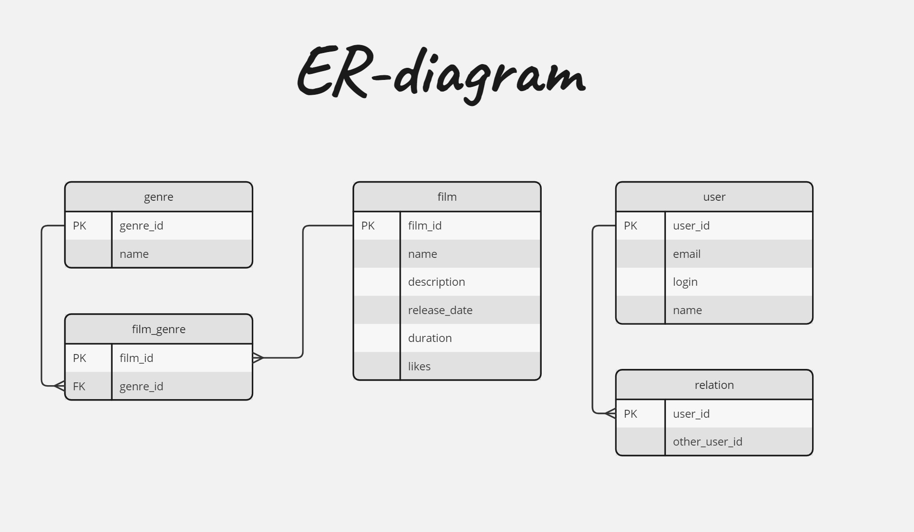

# java-filmorate
ER-диаграмма для проекта java-filmorate


Описание диаграммы: 

**film** - содержит данные о фильмах
- film_id(PK) - идентификатор фильма, является первичным ключом
- name - название фильма
- description - описание фильма
- release_date - дата релиза фильма
- duration - длительность фильма
- rating - возрастной рейтинг фильма

**film_likes** - содержит данные о фильмах которым поставили лайк пользователи

Связана с таблице user связью один(user) ко многим(film_likes) по полю user_id
Связана с таблице film связью один(film) ко многим(film_likes) по полю film_id
- film_id(PK) - идентификатор фильма по которому пользователь ставит лайк, является первичным ключом
- user_id(FK) - идентификатор пользователя, который поставил лайк фильму

**genre** - содержит данные о жанрах фильмов
- genre_id(PK) - идентификатор жанра, является первичным ключом
- name - название жанра

**film_genre** - содержит данные о жанрах фильмах(id)

Связана с таблицей genre связью один(genre) к многим(film_genre) по полю genre_id 
и с таблицей film связью один(film) к многим(film_genre) по полю film_id
- film_id(PK) - идентификатор фильма, является первичным ключом
- genre_id(FK) - идентификатор жанра, является внешним ключом


**user** - содержит данные о пользователях
- user_id(PK) - идентификатор пользователя, является первичным ключом
- email - электронная почта пользователя
- login - логин пользователя
- name - имя или никнейм пользователя
- birthday - день рождения пользователя

**relation** - содержит данные о связях(дружба) пользователей друг с другом

Связана с таблицей user связью один(user) к многим(relation) по полю user_id
- user_id(PK) - идентификатор пользователя, является первичным ключом
- other_user_id - идентификатор другого пользователя (друга)

Примеры SQL запросов:
Получить все фильмы:
```sql
SELECT *
FROM film;
```
Получить фильмы жанра "Триллер":
```sql
SELECT * FROM film as f
JOIN film_genre as fg ON fg.film_id=f.film_id
WHERE f.film_id in (SELECT genre_id FROM genre WHERE name='Триллер');
```
Получить топ 10 популярных фильмов по лайкам:
```sql
SELECT * FROM film
ORDER BY likes DESC
LIMIT 10; 
```
Получить всех пользователей:
```sql
SELECT *
FROM user;
```
Получить всех друзей пользователя с user_id=1:
```sql
SELECT *
FROM user as u
WHERE user_id in (SELECT other_user_id FROM relation as r WHERE r.user_id=1);
```

Получить всех общих друзей пользователя с user_id=1 и user_id=2:
```sql
SELECT *
FROM user as u
WHERE user_id in
(SELECT other_user_id FROM relation as r WHERE r.user_id=1 and other_user_id in (SELECT other_user_id FROM relation as r1 WHERE r1.user_id=2));
```
