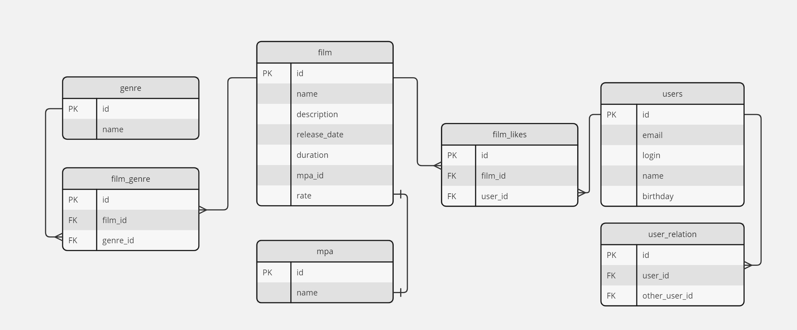

# java-filmorate

ER-диаграмма для проекта java-filmorate


Описание диаграммы:

**film** - содержит данные о фильмах

- id(PK) - идентификатор фильма, является первичным ключом
- name - название фильма
- description - описание фильма
- release_date - дата релиза фильма
- duration - длительность фильма
- mpa_id - идентификатор mpa вторичный ключ ссылается на таблицу mpa(id)
- rate - рейтинг фильма (не используется)

**film_likes** - содержит данные о фильмах которым поставили лайк пользователи
Связана с таблице user связью один(user) ко многим(film_likes) по полю user_id
Связана с таблице film связью один(film) ко многим(film_likes) по полю film_id

- id(PK) - идентификатор первичный ключ
- film_id(FK) - идентификатор фильма по которому пользователь ставит лайк вторичный ключ
- user_id(FK) - идентификатор пользователя, который поставил лайк фильму вторичный ключ

**genre** - содержит данные о жанрах фильмов

- id(PK) - идентификатор жанра, является первичным ключом
- name - название жанра
-

**mpa** - содержит данные о рейтингах фильмов

- id(PK) - идентификатор mpa, является первичным ключом
- name - название mpa

**film_genre** - содержит данные о жанрах фильмах(id)
Связана с таблицей genre связью один(genre) к многим(film_genre) по полю genre_id
и с таблицей film связью один(film) к многим(film_genre) по полю film_id

- id(PK) - идентификатор первичный ключ
- film_id(FK) - идентификатор фильма, является первичным ключом
- genre_id(FK) - идентификатор жанра, является внешним ключом

**user** - содержит данные о пользователях

- id(PK) - идентификатор пользователя, является первичным ключом
- email - электронная почта пользователя
- login - логин пользователя
- name - имя или никнейм пользователя
- birthday - день рождения пользователя

**relation** - содержит данные о связях(дружба) пользователей друг с другом
Связана с таблицей user связью один(user) к многим(relation) по полю user_id

- id(PK) - идентификатор первичный ключ
- user_id(FK) - идентификатор пользователя, является первичным ключом
- other_user_id(FK) - идентификатор другого пользователя (друга)

Примеры SQL запросов:
Получить все фильмы:

```sql
SELECT *
FROM film;
```

Получить фильмы жанра "Триллер":

```sql
SELECT *
FROM film as f
         JOIN film_genre as fg ON fg.film_id = f.id
WHERE f.id in (SELECT genre_id FROM genre WHERE name = 'Триллер');
```

Получить топ 10 популярных фильмов по лайкам:

```sql
SELECT *
FROM film as f
         LEFT JOIN film_like as fl ON fl.film_id = f.id
         JOIN mpa as m ON m.id = f.mpa_id
GROUP BY fl.user_id, f.id
ORDER BY COUNT(fl.user_id) DESC
LIMIT 10; 
```

Получить всех пользователей:

```sql
SELECT *
FROM users;
```

Получить всех друзей пользователя с user_id=1:

```sql
SELECT *
FROM users as u
WHERE id in (SELECT other_user_id FROM user_relation as r WHERE r.user_id = 1);
```

Получить всех общих друзей пользователя с user_id=1 и user_id=2:

```sql
SELECT *
FROM users as u
WHERE id in
      (SELECT other_user_id
       FROM user_relation as r
       WHERE r.user_id = 1
         and other_user_id in
             (SELECT other_user_id FROM USER_RELATION as r1 WHERE r1.user_id = 2));
```
